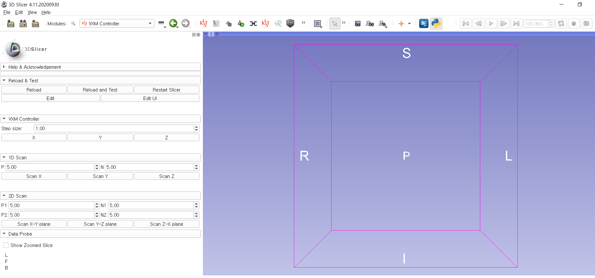
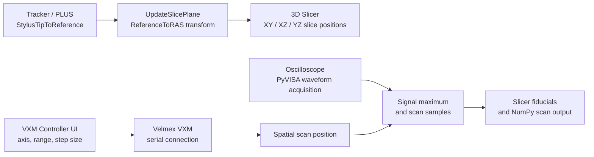
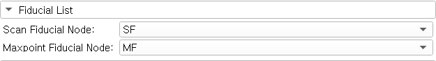
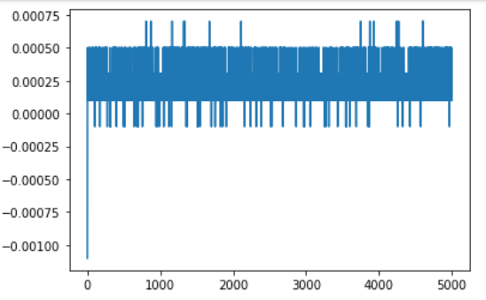

# Ultrasound Brain Tumor Project

**3D Slicer modules for tracked slice navigation, Velmex stage control and ultrasound waveform acquisition.**

Software developed during a KIST internship, with implementation evidence from the February 2021 project presentation. The repository name follows the internship project designation; the released code implements navigation and scanning infrastructure. Tumor segmentation, treatment planning and a tumor-classification model are not part of this source release.



*Historical VXM interface, 3D Slicer 4.11.20200930. Source: `알키미스트 0225.pptx`, slide 26. The supplied source also includes 3D scanning and maximum-point search controls.*

## System



| Module | Implemented functions |
|---|---|
| `UpdateSlicePlane` | Apply transformed stylus-tip coordinates to orthogonal slices; automatic update; stop; reset |
| `VXMController` | Signed X/Y/Z movement, adjustable step size, 1D/2D/3D scans, 2D/3D maximum-point searches |
| Embedded `VelmexController` | Serial setup, step conversion, motor commands, motion timing and position bookkeeping |
| `Submodule/Oscilloscope.py` | VISA connection, channel acquisition and waveform scaling |



*Separate fiducial lists for sampled positions and maximum-signal positions; slide 30.*

## Project measurements

| Demonstrated operation | Before | After | Context |
|---|---:|---:|---|
| Example scan sequence | 14.7 s | 4.4 s | Slide 27 reports approximately 3.3× speed improvement through step-size and wait-time changes |

These are historical presentation values, not benchmarks rerun for this release. The implementation retains the original motor command and timing logic.



*Waveform plot from slide 34. No participant-level measurement files or medical-image scene files are included.*

## Load in 3D Slicer

The original interface was developed with **3D Slicer 4.11.20200930**. It depends on Slicer's bundled `vtk`, `qt`, `ctk`, `slicer` and NumPy; ordinary CPython alone cannot run these GUI modules. Compatibility with newer Slicer releases and physical instruments has not been verified in this release.

1. Clone or download this repository.
2. In Slicer's Python console, install the device dependencies:

   ```python
   slicer.util.pip_install("pyserial pyvisa")
   ```

3. Add the repository's `UpdateSlicePlane` and `VXMController` directories under **Edit → Application Settings → Modules → Additional module paths**, then restart Slicer.
4. For slice navigation, provide the `StylusTipToReference` and `ReferenceToRAS` transforms and select them in `UpdateSlicePlane`. **Apply** updates once; **Auto** observes stylus transform changes; **Stop** removes the observer; **Reset** restores the starting slice coordinates.
5. For instrument use, install the vendor VISA runtime and configure these variables in Slicer's Python console before using the controller:

   ```python
   import os
   os.environ["VXM_SERIAL_PORT"] = "COM4"  # set the actual stage port
   os.environ["VXM_VISA_RESOURCE"] = "YOUR_VISA_RESOURCE_STRING"
   # To enumerate instruments without moving the stage:
   import pyvisa
   print(pyvisa.ResourceManager().list_resources())
   ```

`VXM_SERIAL_PORT` defaults to the original `COM4`; `VXM_VISA_RESOURCE` must be set explicitly. Scans save `vxm_scan.npy` in `slicer.app.temporaryPath`; subsequent saves overwrite that temporary file, as in the original single-output workflow.

The original controller initialization sends motor setup commands. Verify axis direction, mechanical travel and step conversion on the actual apparatus before motion. This archival implementation has no added hardware interlocks.

## Source layout

```text
UpdateSlicePlane/
  UpdateSlicePlane.py
  Resources/
VXMController/
  VXMController.py          # includes the controller used by the GUI
  Submodule/Oscilloscope.py
  Resources/
docs/
  figures/
  source-manifest.json
  release-notes.md
```

The source package copies of the two main modules match the supplied top-level copies. Duplicate scripts, backups, ZIP archives, generated caches, sample scenes and raw data are omitted. Template CMake/SuperBuild scaffolding is omitted; this release uses Slicer's additional-module-path installation.

## Validation and limitations

All released Python modules pass syntax compilation. No stage movement was issued. Slicer GUI behavior, instrument I/O and scan timing require verification in the original environment. In particular, the archived oscilloscope code configures ASCII encoding while parsing fixed-length binary bytes; this known device-protocol inconsistency is documented in [release notes](docs/release-notes.md) and is not represented as a validated acquisition backend.

## Attribution and license

Original module contributor: **Daehyeon Kim (KIST & Kwangwoon University)**. Slicer template acknowledgements are retained. Project modifications are under [MIT](LICENSE); inherited Slicer portions remain subject to the [Slicer license](LICENSES/Slicer.txt). These are modified internship modules, not an official Slicer release. See [third-party notices](THIRD_PARTY_NOTICES.md).
