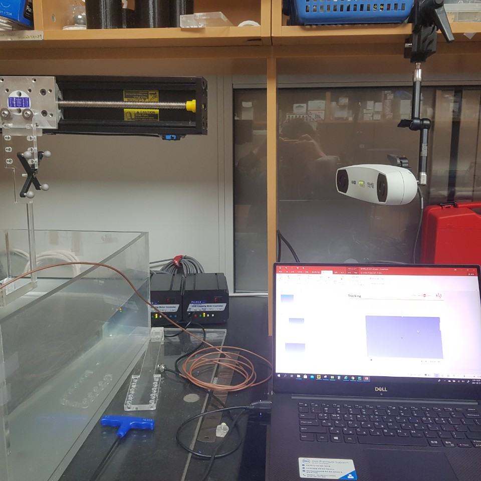
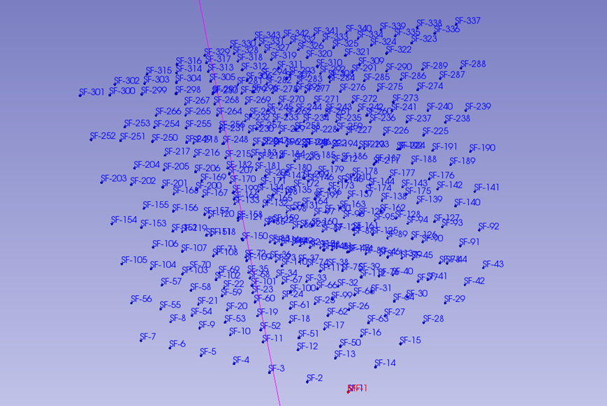
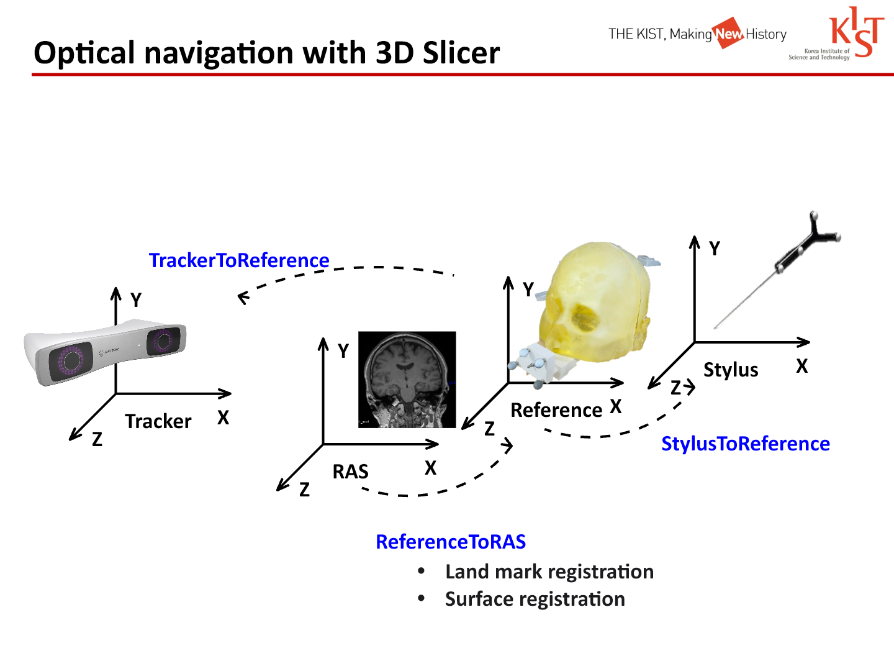
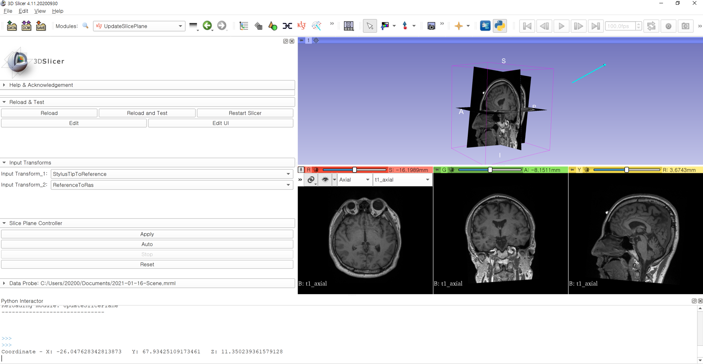
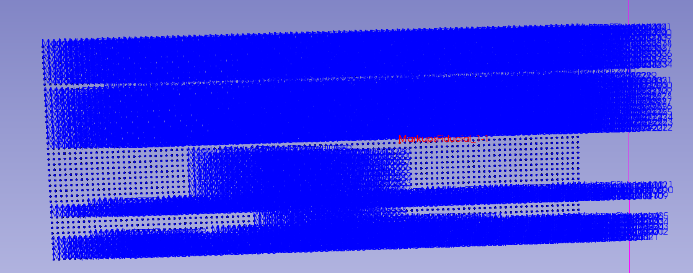
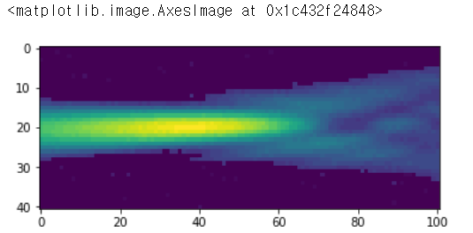
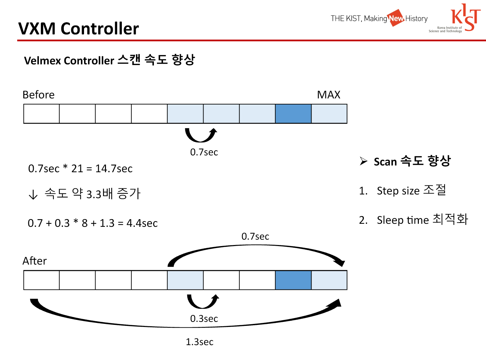
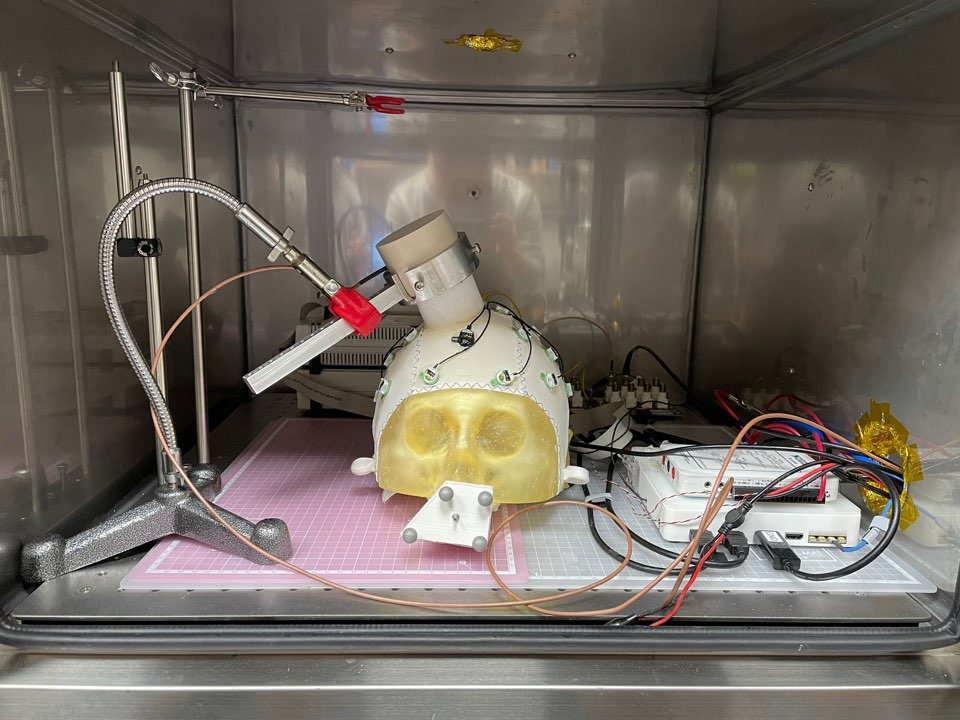

# Ultrasound Brain Tumor Project

**Optical navigation, tracked slice control and spatial ultrasound scanning in 3D Slicer.**

KIST internship software with project demonstrations documented in January and February 2021. The two released modules connect tracked coordinates to anatomical slice views and combine Velmex stage motion with oscilloscope acquisition. The figures below come from the original internship presentations.

| Tracking and acquisition apparatus | 3D scan in Slicer |
|:---:|:---:|
|  |  |
| Optical tracker, stage, water tank and control computer. February presentation, slide 38. | 7 × 7 × 7 scan grid. Blue markers record sample positions; the red marker identifies the selected maximum. February presentation, slide 30. |

The release covers the navigation and scanning components of the internship project. Its scope and hardware limitations are documented in [release notes](docs/release-notes.md).

## Optical navigation and coordinate registration



*Original coordinate-frame diagram, February presentation, slide 18; also described in the January presentation, slide 4.*

Tracking and image coordinates meet through `ReferenceToRAS`, obtained in the registration workflow. `UpdateSlicePlane` composes that matrix with `StylusTipToReference`:

```text
T_StylusTipToRAS = T_ReferenceToRAS @ T_StylusTipToReference
slice position  = T_StylusTipToRAS[:3, 3]
```

The module reads the resulting translation and moves the Red/Green/Yellow slice planes along Z/Y/X, respectively. Registration supplies the input transform; it is not estimated by `UpdateSlicePlane` itself.

The January presentation describes recording a stylus path over the forehead and nose, placing more than 40 fiducials, and registering them to the reconstructed surface. It reports the following example:

| Registration method | Reported RMSE |
|---|---:|
| Landmark registration | 7.12 |
| Surface registration | 0.57 |

*January presentation, slides 9–12. The source slide does not state the RMSE unit or evaluation sample count; these values describe that demonstration only.*

## Tracked slice control



*Implemented `UpdateSlicePlane` interface, January presentation, slide 7. This historical screenshot shows the anatomical views used in the module demonstration.*

| Control | Behavior |
|---|---|
| **Apply** | Read the selected transforms and update all three slice positions once |
| **Auto** | Observe changes to the stylus transform and update slice positions |
| **Stop** | Remove the stylus-transform observer |
| **Reset** | Restore the slice positions captured when the module opened |

The module replaces manual slice placement with coordinates from the transform chain. The January slides identify manual clicking and fiducial placement as sources of positioning discrepancies; they do not provide a separate accuracy benchmark for the slice-control module.

Implementation: [`UpdateSlicePlane.py`](UpdateSlicePlane/UpdateSlicePlane.py), methods `UpdateSlicePlane`, `onAutoButton`, `onStopButton` and `ResetSlicePlane`.

## Spatial scanning and waveform acquisition


*VXM interface, February presentation, slide 26. The final source additionally contains 3D scanning and maximum-point search controls.*

| Component | Implemented functions |
|---|---|
| VXM GUI | Signed X/Y/Z motion, step-size and scan-range settings, 1D/2D/3D scans, 2D/3D maximum-point searches |
| Embedded `VelmexController` | Serial setup, millimetre-to-step conversion, motor commands and position bookkeeping |
| `Oscilloscope.py` | VISA connection, waveform acquisition and amplitude scaling |
| Slicer fiducials | Sample-position markers, maximum-point marker and per-layer display lists |

| 2D scan coverage | 2D scan visualization |
|:---:|:---:|
|  |  |
| Sample positions displayed in Slicer, February slide 33. | Plot shown with the 2D scan, February slide 34. The original axes have no physical units or colorbar. |

The scan code records a waveform at each position. In 3D, the stored array has `[z, y, x, waveform_samples]` order. It takes the maximum waveform value at each grid location, locates the overall maximum and moves the stage to that position. This is a sample-amplitude criterion; the source does not convert it into calibrated acoustic pressure.


*An acquired waveform example from February slide 34. The original plot uses sample indices and does not label physical units. The complete waveform pair and display-management screenshots are in the [figure guide](docs/figures.md).*

Implementation: [`VXMController.py`](VXMController/VXMController.py), methods `TwoDScan`, `ThreeDScan`, `placeScanFiducial` and `placeMaxFiducial`; [`Oscilloscope.py`](VXMController/Submodule/Oscilloscope.py), `getData`.

## Scan-time optimization



*Original motion and wait-time diagram, February presentation, slide 27.*

| Example sequence | Reported timing | Total |
|---|---|---:|
| Before | 0.7 s × 21 | 14.7 s |
| After | 0.7 s + 0.3 s × 8 + 1.3 s | 4.4 s |

The presentation attributes the approximately **3.3×** speed improvement to step-size changes and shorter waits during the scan. These are historical demonstration timings. The preserved implementation uses a step-dependent `sleeptime` function; actual travel and settling times depend on the apparatus.

## Additional internship experiments



*EEG–FUS interference experiment in a shielding enclosure, February presentation, slide 5.*

The presentations also document EEG–FUS interference checks with a skull phantom. The [figure guide](docs/figures.md#eegfus-interference-check) includes the original control/FUS spectra and the reported observation. This material provides experimental context; the EEG analysis implementation is not included in the two Slicer modules.

All 15 figure assets have source slide numbers and extraction/rendering details in the [figure manifest](docs/figure-manifest.json). Embedded screenshots and plots retain their original pixels; the coordinate and timing diagrams are full-slide renders.

## Load in 3D Slicer

The original interface was developed with **3D Slicer 4.11.20200930**. It depends on Slicer's bundled `vtk`, `qt`, `ctk`, `slicer` and NumPy; ordinary CPython alone cannot run these GUI modules. Compatibility with newer Slicer releases and physical instruments has not been verified in this release.

1. Clone or download this repository.
2. In Slicer's Python console, install the device dependencies:

   ```python
   slicer.util.pip_install("pyserial pyvisa")
   ```

3. Add the repository's `UpdateSlicePlane` and `VXMController` directories under **Edit → Application Settings → Modules → Additional module paths**, then restart Slicer.
4. For slice navigation, provide the `StylusTipToReference` and `ReferenceToRAS` transforms and select them in `UpdateSlicePlane`. **Apply** updates once; **Auto** observes stylus transform changes; **Stop** removes the observer; **Reset** restores the starting slice coordinates.
5. For instrument use, install the vendor VISA runtime and configure these variables in Slicer's Python console before using the controller:

   ```python
   import os
   os.environ["VXM_SERIAL_PORT"] = "COM4"  # set the actual stage port
   os.environ["VXM_VISA_RESOURCE"] = "YOUR_VISA_RESOURCE_STRING"
   # To enumerate instruments without moving the stage:
   import pyvisa
   print(pyvisa.ResourceManager().list_resources())
   ```

`VXM_SERIAL_PORT` defaults to the original `COM4`; `VXM_VISA_RESOURCE` must be set explicitly. Scans save `vxm_scan.npy` in `slicer.app.temporaryPath`; subsequent saves overwrite that temporary file, as in the original single-output workflow.

The original controller initialization sends motor setup commands. Verify axis direction, mechanical travel and step conversion on the actual apparatus before motion. This archival implementation has no added hardware interlocks.

## Source layout

```text
UpdateSlicePlane/
  UpdateSlicePlane.py
  Resources/
VXMController/
  VXMController.py          # includes the controller used by the GUI
  Submodule/Oscilloscope.py
  Resources/
docs/
  figures/
  source-manifest.json
  release-notes.md
```

The source package copies of the two main modules match the supplied top-level copies. Duplicate scripts, backups, ZIP archives, generated caches, sample scenes and raw data are omitted. Template CMake/SuperBuild scaffolding is omitted; this release uses Slicer's additional-module-path installation.

## Validation and limitations

All released Python modules pass syntax compilation. No stage movement was issued. Slicer GUI behavior, instrument I/O and scan timing require verification in the original environment. In particular, the archived oscilloscope code configures ASCII encoding while parsing fixed-length binary bytes; this known device-protocol inconsistency is documented in [release notes](docs/release-notes.md) and is not represented as a validated acquisition backend.

## Attribution and license

Original module contributor: **Daehyeon Kim (KIST & Kwangwoon University)**. Slicer template acknowledgements are retained. Project modifications are under [MIT](LICENSE); inherited Slicer portions remain subject to the [Slicer license](LICENSES/Slicer.txt). These are modified internship modules, not an official Slicer release. See [third-party notices](THIRD_PARTY_NOTICES.md).
