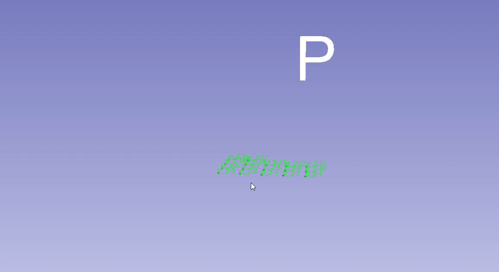
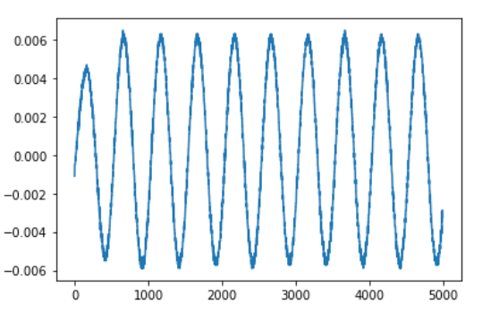
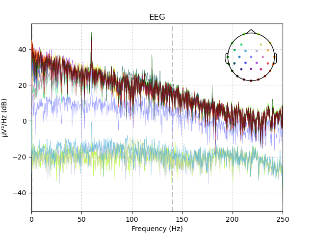
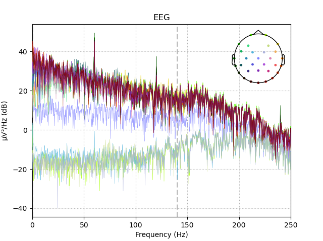

# Internship figure guide

Original presentation figures support the [navigation, scanning and timing overview](../README.md). This guide retains additional implementation detail and the EEG–FUS experiment context.

Source decks: `알키미스트 0119.pptx` and `알키미스트 0225.pptx`. Slide numbers below are one-based. The [figure manifest](figure-manifest.json) records the source media/XML part and SHA-256 for every published asset.

## Fiducials and 3D display management

*February slide 30.* `Scan Fiducial Node` stores sample positions; `Maxpoint Fiducial Node` stores the selected maximum. The [7 × 7 × 7 example](figures/scan-grid-3d.png) in the README shows how these lists appear together.

*February slide 36.* The presentation identifies rendering delays as the number of visible fiducials grows and describes hiding older layers. `ThreeDScan` creates separate `sf_...` nodes and hides the previous layer as it advances. This screenshot illustrates the display strategy, not a measured frame-rate improvement.

## Waveform examples from the 2D scan

| Waveform example A | Waveform example B |
|:---:|:---:|
|  |  |

*Both plots: February slide 34.* The presentation places these waveforms alongside the [2D map](figures/scan-map-2d.png). It does not specify physical axis units or identify which map coordinates produced each waveform. They are retained as original acquisition examples without assigning unsupported signal labels or pressure values.

The archival `getData` implementation requests ASCII encoding but parses fixed-length binary bytes. The plots document the original presentation; they do not resolve that source-code inconsistency. See [release limitations](release-notes.md#known-limitations).

## EEG–FUS interference check

The February presentation describes a repeat experiment inside an EEG shielding enclosure after interference was observed in the initial setup. A skull phantom and ultrasound transducer appear in the [apparatus photograph](figures/eeg-fus-phantom.jpg).

| Control | FUS, 1 s on / 1 s off |
|:---:|:---:|
|  |  |

*February slide 7. Condition labels follow the original slide positions.*

The slide reports that no EEG–FUS noise was observed in the EEG analysis band for this shielded setup. It does not state the band limits, a quantitative difference test, repeated-trial statistics or a general interference specification. The spectra support the reported qualitative comparison under those conditions.

## Figure index

| Asset | Presentation / slide | Purpose |
|---|---|---|
| [Tracking apparatus](figures/tracking-apparatus.png) | February / 38 | Optical tracker, stage and acquisition environment |
| [Coordinate frames](figures/navigation-coordinate-frames.png) | February / 18 | Tracker, stylus, reference and RAS transform relationships |
| [Slice navigation](figures/slice-navigation.png) | January / 7 | Implemented module controls and anatomical slice views |
| [VXM interface](figures/vxm-interface.png) | February / 26 | Axis and scan controls |
| [3D scan grid](figures/scan-grid-3d.png) | February / 30 | 7 × 7 × 7 sampled positions and maximum marker |
| [Fiducial controls](figures/fiducial-controls.png) | February / 30 | Separate output lists |
| [2D coverage](figures/scan-coverage-2d.png) | February / 33 | Spatial sampling coverage |
| [2D map](figures/scan-map-2d.png) | February / 34 | Original scan visualization |
| [Waveform A](figures/acquired-waveform.png) | February / 34 | Acquisition example |
| [Waveform B](figures/waveform-example.png) | February / 34 | Acquisition example |
| [Layer visibility](figures/scan-layer-visibility.png) | February / 36 | Slicer display management |
| [Timing comparison](figures/scan-timing-comparison.png) | February / 27 | Original before/after motion sequence |
| [EEG–FUS apparatus](figures/eeg-fus-phantom.jpg) | February / 5 | Phantom experiment setup |
| [Control spectrum](figures/eeg-control-spectrum.png) | February / 7 | Control-condition spectral plot |
| [FUS spectrum](figures/eeg-fus-spectrum.png) | February / 7 | FUS-condition spectral plot |

The two full-slide diagrams preserve the presentation's figures and labels through rendering. All other assets are extracted directly from embedded media. The materials retain their original attribution, logos and rights as described in [third-party notices](../THIRD_PARTY_NOTICES.md).
